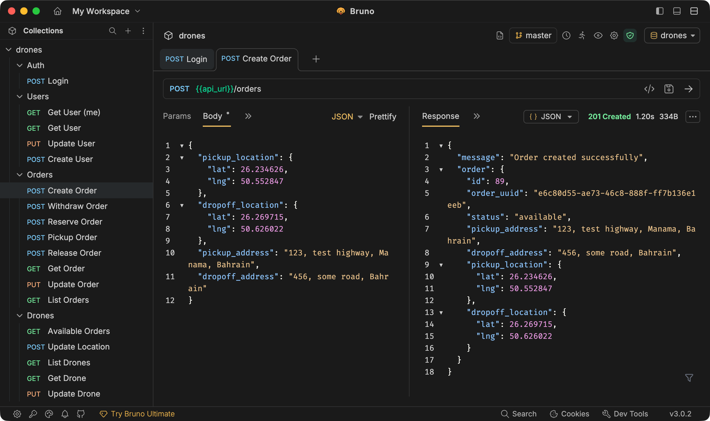

# Drone Delivery API 🚁


> A real-time drone delivery management system with intelligent failure recovery, role-based access control, and live tracking capabilities.

---

## Table of Contents

- [Features](#features)
- [Architecture & Tech Stack](#architecture--tech-stack)
- [Quick Start](#quick-start)
- [Environment Variables](#environment-variables)
- [Docker Deployment](#docker-deployment)
- [API Reference](#api-reference)
- [Testing](#testing)
- [Considerations](#considerations)

---

## Features

✈️ **Real-time Tracking** — Live drone and order tracking via Socket.io  
🔄 **Intelligent Failure Recovery** — Automatic handoff when drones fail mid-delivery  
🔐 **Role-based Access** — JWT authentication with Admin, User, and Drone roles  
📍 **Spatial Support** — Location tracking using MariaDB's native POINT types  
📝 **Full Audit Trail** — All actions logged in the `activity_log` table


---

## Architecture & Tech Stack

| Layer | Technology |
|-------|------------|
| **Language** | Node.js (v18+) |
| **Frameworks** | Express.js + TypeScript |
| **Database** | MariaDB (v10.2+) with Spatial types (POINT) |
| **Auth** | JWT|

---

## Live Demo

🌐 **API URL:** [`https://drones-api.the-ghost.com`](https://drones-api.the-ghost.com)

> Email me for test user credentials

## Quick Start

### Prerequisites

- Node.js v18+
- MariaDB v10.2+ *(Required for `POINT` and spatial functions)*

### 1. Clone & Install

```bash
git clone <repo_url>
cd drones
npm install
```

### 2. Configure Environment

```bash
cp .env.example .env
```

Edit `.env` with your database credentials and JWT secret (see [Environment Variables](#environment-variables)).

### 3. Setup Database

Import the schema from `documentation/db_schema.sql`:

> **Note:** The schema includes a default admin user:  
> **Username:** `admin` | **Password:** `123456789`

### 4. Run

```bash
# Development (with hot-reload)
npm run dev

# Production
npm run build
npm run start

# Run Tests
npm test
```

---

## Environment Variables

| Variable | Description | 
|----------|-------------|
| `PORT` | Server port |
| `JWT_SECRET` | Secret key for JWT tokens |
| `NODE_ENV` | Environment (`development` / `production`) |
| `DB_HOST` | Database host |
| `DB_PORT` | Database port |
| `DB_USER` | Database username |
| `DB_PASS` | Database password |
| `DB_NAME` | Database name |

---

## Docker Deployment

### Build

```bash
docker build -t drone-delivery-api .
```

### Run

```bash
docker run -d 
  -p 8000:8000 
  -e JWT_SECRET=your_secret_here 
  -e DB_HOST=127.0.0.1 
  -e DB_USER=root 
  -e DB_PASS=your_password 
  -e DB_NAME=drones 
  --name drone-api 
  drone-delivery-api
```


## API Documentation

For detailed request/response examples, see the Bruno and Postman collections in `/documentation`.



### Authentication

| Method | Endpoint | Description |
|--------|----------|-------------|
| `POST` | `/auth` | Login and retrieve JWT token |

### Users

| Method | Endpoint | Description |
|--------|----------|-------------|
| `GET` | `/users/me` | Get current user details |
| `GET` | `/users/:id` | Get specific user details |
| `POST` | `/users` | Create a new user |
| `PUT` | `/users/:id` | Update user details |

### Orders

| Method | Endpoint | Description |
|--------|----------|-------------|
| `GET` | `/orders` | List orders (supports filtering) |
| `POST` | `/orders` | Create a new order |
| `GET` | `/orders/:id` | Get order details |
| `PUT` | `/orders/:id` | Update order details *(Admin)* |
| `POST` | `/orders/:id/withdraw` | Withdraw a pending order |
| `POST` | `/orders/:id/reserve` | Reserve an order *(Drone)* |
| `POST` | `/orders/:id/pickup` | Mark order as picked up *(Drone)* |
| `POST` | `/orders/:id/release` | Release order (Delivered or Broken) |

### Drones

| Method | Endpoint | Description |
|--------|----------|-------------|
| `GET` | `/drones` | List all drones |
| `GET` | `/drones/:id` | Get drone details |
| `PUT` | `/drones/:id` | Update drone status or details |
| `POST` | `/drones/location` | Update drone location |
| `GET` | `/drones/available_orders` | Get orders available for pickup |

---

## Testing

### Recommended Test Flow

1. **Auth** — Log in as `admin`, `user`, and `drone` to get tokens
2. **User** — Create an order (`POST /orders`)
3. **Drone** — Reserve the order (`POST /orders/:id/reserve`)
4. **Drone** — Pick it up (`POST /orders/:id/pickup`)
5. **Simulate Failure** — Call `POST /orders/:id/release` with body:
   ```json
   { "release_type": "broken", "latitude": 25.123, "longitude": 55.456 }
   ```
6. **Verify** — List orders (`GET /orders`). The order is now `available` at the new coordinates.

### The "Broken Drone" Handoff

When a drone reports a failure during delivery (`POST /orders/:id/release` with `release_type: "broken"`):

1. The drone's status updates to `broken`
2. The order is immediately unassigned
3. The order's **pickup location** is updated to the *drone's current location*
4. The order status resets to `available`, allowing another drone to reserve it immediately

###  Automated Tests

```bash
npm test
```

---

## Considerations

To keep the project simple, location history is stored in the MariaDB database. In a production environment, this can lead to performance issues at scale. For real-world use, a different database type should be used for storing location history.
